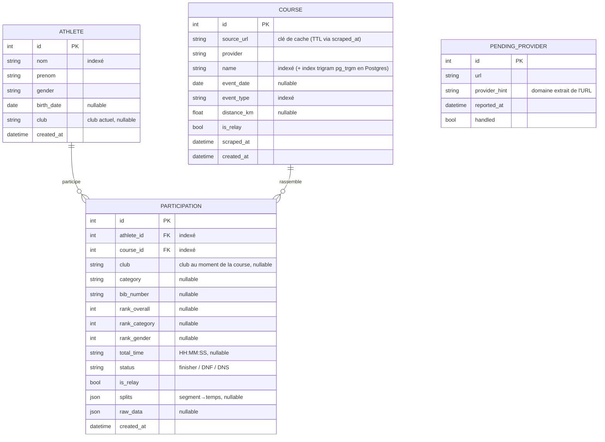

# Modèle de données — data-triathlon

Documentation du modèle conceptuel et physique de la base. Généré à partir des
entités SQLAlchemy (`backend/app/models/`) et des migrations Alembic
(`backend/alembic/versions/`).

> Source de vérité du schéma : les migrations Alembic. Ce document est une vue
> de synthèse ; en cas de divergence, se référer aux modèles et migrations.

## Vue d'ensemble

Le modèle est **normalisé** autour de trois entités principales reliées par une
table d'association, plus une entité technique isolée :

- **Athlete** — une personne physique, dédoublonnée (une seule fois en base
  quelle que soit le nombre de courses).
- **Course** — une épreuve (un « heat » : nom + date + type + relais).
- **Participation** — le résultat d'un athlète sur une course. C'est la table
  d'association qui porte les classements, temps et splits.
- **PendingProvider** — entité technique isolée : URLs dont le scraping a échoué,
  signalées pour implémentation future. Aucune relation avec les autres tables.

`Participation` matérialise la relation **plusieurs-à-plusieurs** entre `Athlete`
et `Course` : un athlète court plusieurs épreuves, une épreuve rassemble plusieurs
athlètes.

## MCD (diagramme entité-association)

> `PENDING_PROVIDER` est dessinée sans relation : elle est volontairement isolée
> du graphe métier.

## Contraintes d'unicité (dédoublonnage)

La normalisation repose sur trois contraintes d'unicité qui garantissent
l'absence de doublons à l'import :

| Table            | Contrainte                | Colonnes                                       | Rôle                                                         |
| ---------------- | ------------------------- | ---------------------------------------------- | ----------------------------------------------------------- |
| `athletes`       | `uq_athlete_identity`     | `nom`, `prenom`, `birth_date`                  | Une personne = une seule ligne, quelles que soient ses courses |
| `courses`        | `uq_course_identity`      | `name`, `event_date`, `event_type`, `is_relay` | Une épreuve (heat) = une seule ligne ; le relais est un heat distinct |
| `participations` | `uq_participation_bib`    | `course_id`, `bib_number`                      | Un dossard est unique au sein d'une course → import idempotent |

## Détails de modélisation

### Splits en JSON
La colonne `participations.splits` (JSON segment→temps) remplace les colonnes
figées `swim/t1/bike/t2/run`. Elle couvre tous les sports (duathlon
`course1`/`course2`, swimrun…). Les temps restent des **strings** normalisées
`"HH:MM:SS"`. Les clés de segment sont réétiquetées selon `event_type` par
`services/mapping.build_splits` (gabarit `_SPLIT_KEYS_BY_SPORT`).

### `is_relay` : porté à deux niveaux
- `courses.is_relay` — fait partie de l'identité de la course (un relais est un
  heat distinct, contrainte `uq_course_identity`).
- `participations.is_relay` — TimePulse mélange solos et relais dans une même
  course ; l'info est alors portée par la participation. `server_default="false"`.

### Cache TTL
`courses.source_url` est la clé de cache et `courses.scraped_at` l'horodatage.
`services/cache.is_fresh()` court-circuite le re-scraping : 10 min si la course
est en cours (une participation sans `total_time`), sinon 30 jours.

### Recherche fuzzy (Postgres uniquement)
Migration `a1b2c3d4e5f6` : extension `pg_trgm` + index GIN trigram
`ix_courses_name_trgm` sur `courses.name` pour une recherche tolérante aux
fautes. En SQLite (dev), la recherche retombe sur un `ILIKE` sous-chaîne.

### Cascade de suppression
Supprimer un `Athlete` ou une `Course` supprime ses `Participation` associées
(`cascade="all, delete-orphan"` côté ORM).

## Historique des migrations Alembic

| Ordre | Révision           | Description                                                |
| ----- | ------------------ | ---------------------------------------------------------- |
| 1     | `e4211f35a275`     | Schéma initial (4 tables, contraintes d'unicité, index)    |
| 2     | `e734b8c5c962`     | Ajout `courses.distance_km` + reclassement `event_type`    |
| 3     | `723259e01cdd`     | Ajout `participations.is_relay`                            |
| 4     | `a1b2c3d4e5f6`     | Extension `pg_trgm` + index trigram sur `courses.name`     |
| 5     | `b2c3d4e5f6a7`     | Ajout `courses.is_relay` dans l'identité de course         |

> L'ordre ci-dessus suit la chaîne `down_revision` ; lancer
> `alembic history` pour la liste à jour.
