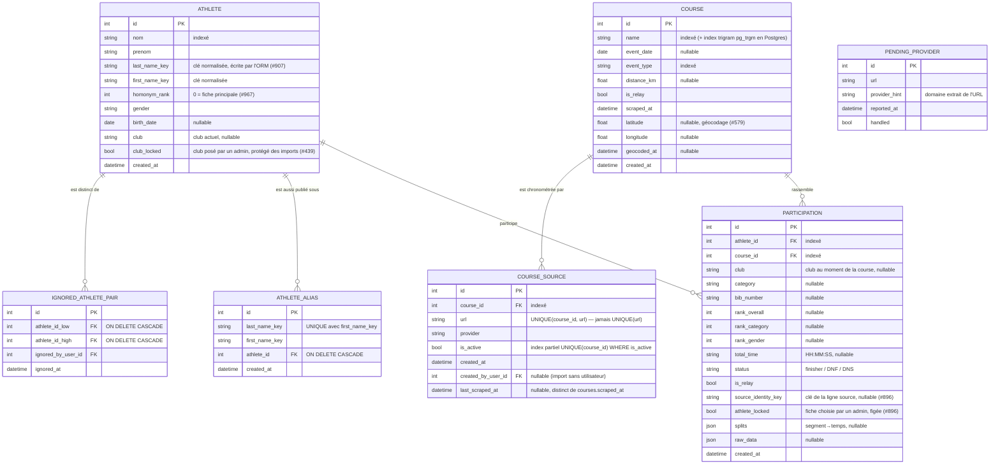

# Modèle de données — data-triathlon

Documentation du modèle conceptuel et physique de la base. Généré à partir des
entités SQLAlchemy (`backend/app/models/`) et des migrations Alembic
(`backend/alembic/versions/`).

> Source de vérité du schéma : les migrations Alembic. Ce document est une vue
> de synthèse ; en cas de divergence, se référer aux modèles et migrations.

## Vue d'ensemble

Le modèle est **normalisé** autour de trois entités principales reliées par une
table d'association, plus une entité technique isolée :

- **Athlete** — une personne physique, dédoublonnée (une seule fois en base
  quel que soit le nombre de courses) par la clé normalisée de son nom et de
  son prénom (#907) : casse, accents, ponctuation et espaces ignorés, chiffres
  gardés. Deux homonymes réels se distinguent par `homonym_rank` (0 = fiche
  principale, la seule que l'import vise). La date de naissance n'entre pas dans
  l'identité (#900).
- **AthleteAlias** — une graphie absorbée par une fusion (#908), que l'import
  résout comme l'identité de la fiche conservée.
- **IgnoredAthletePair** — deux fiches qu'un admin a déclarées deux personnes
  (#908) : ni la revue d'identité ni la reprise ne les rapprochent plus.
- **Course** — une épreuve (un « heat » : nom + date + type + relais).
- **CourseSource** — les **N chronométrages** d'une même épreuve, dont un seul
  **actif** (#278). C'est elle, et elle seule, qui porte l'URL d'import et le
  provider : `Course.source_url` et `Course.provider` sont des propriétés dérivées
  de la source active depuis #279, plus des colonnes.
- **Participation** — le résultat d'un athlète sur une course. C'est la table
  d'association qui porte les classements, temps et splits. Elle est portée par la
  `Course`, **jamais** par la source : le classement affiché ne mélange pas deux
  chronométreurs.
- **PendingProvider** — entité technique isolée : URLs dont le scraping a échoué,
  signalées pour implémentation future. Aucune relation avec les autres tables.

`Participation` matérialise la relation **plusieurs-à-plusieurs** entre `Athlete`
et `Course` : un athlète court plusieurs épreuves, une épreuve rassemble plusieurs
athlètes.

## MCD (diagramme entité-association)

```mermaid
erDiagram
    ATHLETE ||--o{ PARTICIPATION : "participe"
    ATHLETE ||--o{ ATHLETE_ALIAS : "est aussi publié sous"
    ATHLETE ||--o{ IGNORED_ATHLETE_PAIR : "est distinct de"
    COURSE  ||--o{ PARTICIPATION : "rassemble"
    COURSE  ||--o{ COURSE_SOURCE : "est chronométrée par"

    ATHLETE {
        int id PK
        string nom "indexé"
        string prenom
        string last_name_key "clé normalisée, écrite par l'ORM (#907)"
        string first_name_key "clé normalisée"
        int homonym_rank "0 = fiche principale (#967)"
        string gender
        date birth_date "nullable"
        string club "club actuel, nullable"
        bool club_locked "club posé par un admin, protégé des imports (#439)"
        datetime created_at
    }

    COURSE {
        int id PK
        string name "indexé (+ index trigram pg_trgm en Postgres)"
        date event_date "nullable"
        string event_type "indexé"
        float distance_km "nullable"
        bool is_relay
        datetime scraped_at
        float latitude "nullable, géocodage (#579)"
        float longitude "nullable"
        datetime geocoded_at "nullable"
        datetime created_at
    }

    COURSE_SOURCE {
        int id PK
        int course_id FK "indexé"
        string url "UNIQUE(course_id, url) — jamais UNIQUE(url)"
        string provider
        bool is_active "index partiel UNIQUE(course_id) WHERE is_active"
        datetime created_at
        int created_by_user_id FK "nullable (import sans utilisateur)"
        datetime last_scraped_at "nullable, distinct de courses.scraped_at"
    }

    PARTICIPATION {
        int id PK
        int athlete_id FK "indexé"
        int course_id FK "indexé"
        string club "club au moment de la course, nullable"
        string category "nullable"
        string bib_number "nullable"
        int rank_overall "nullable"
        int rank_category "nullable"
        int rank_gender "nullable"
        string total_time "HH:MM:SS, nullable"
        string status "finisher / DNF / DNS"
        bool is_relay
        string source_identity_key "clé de la ligne source, nullable (#896)"
        bool athlete_locked "fiche choisie par un admin, figée (#896)"
        json splits "segment→temps, nullable"
        json raw_data "nullable"
        datetime created_at
    }

    ATHLETE_ALIAS {
        int id PK
        string last_name_key "UNIQUE avec first_name_key"
        string first_name_key
        int athlete_id FK "ON DELETE CASCADE"
        datetime created_at
    }

    IGNORED_ATHLETE_PAIR {
        int id PK
        int athlete_id_low FK "ON DELETE CASCADE"
        int athlete_id_high FK "ON DELETE CASCADE"
        int ignored_by_user_id FK
        datetime ignored_at
    }

    PENDING_PROVIDER {
        int id PK
        string url
        string provider_hint "domaine extrait de l'URL"
        datetime reported_at
        bool handled
    }
```

> `PENDING_PROVIDER` est dessinée sans relation : elle est volontairement isolée
> du graphe métier.

## Contraintes d'unicité (dédoublonnage)

La normalisation repose sur sept contraintes d'unicité qui garantissent
l'absence de doublons à l'import :

| Table            | Contrainte                | Colonnes                                       | Rôle                                                         |
| ---------------- | ------------------------- | ---------------------------------------------- | ----------------------------------------------------------- |
| `athletes`       | `uq_athlete_identity`     | `last_name_key`, `first_name_key`, `homonym_rank` | Une personne = une seule ligne, quelles que soient ses courses et la graphie du chronométreur. Rang 0 = fiche principale, la seule que l'import vise. Clés calculées en Python (`core/athlete_identity`) et stockées : `unaccent` n'est pas immuable en PostgreSQL. La date de naissance n'en fait plus partie (#900) |
| `athlete_aliases` | `uq_athlete_alias`       | `last_name_key`, `first_name_key`              | Une graphie absorbée n'appartient qu'à une fiche ; elle la suit dans les fusions suivantes |
| `ignored_athlete_pairs` | `uq_ignored_athlete_pair` | `athlete_id_low`, `athlete_id_high`  | Une paire déclarée distincte une seule fois, normalisée (le plus petit id en premier) |
| `courses`        | `uq_course_identity`      | `name`, `event_date`, `event_type`, `is_relay` | Une épreuve (heat) = une seule ligne ; le relais est un heat distinct |
| `participations` | `uq_participation_bib`    | `course_id`, `bib_number`                      | Un dossard est unique au sein d'une course → import idempotent |
| `course_sources` | `uq_course_source_url`    | `course_id`, `url`                             | Une URL n'est rattachée qu'une fois à une épreuve donnée — **et surtout pas `UNIQUE(url)`** : une URL porte légitimement N épreuves (heats Klikego, multi-catégories Wiclax, multi-listes RaceResult, multi-épreuves Chronoplace) |
| `course_sources` | `uq_course_source_active` | `course_id` **`WHERE is_active`**              | Une seule source active par épreuve, tenue par la base et non par une lecture préalable. Index **partiel** : il porte `sqlite_where=` *et* `postgresql_where=`, sans quoi l'autre moteur reçoit un index complet et interdit les passives |

## Détails de modélisation

### Splits en JSON
La colonne `participations.splits` (JSON segment→temps) remplace les colonnes
figées `swim/t1/bike/t2/run`. Elle couvre tous les sports (duathlon
`course1`/`course2`, swimrun…). Les temps restent des **strings** normalisées
`"HH:MM:SS"`. Les clés de segment sont réétiquetées selon `event_type` par
`services/mapping.build_splits` (gabarit `_SPLIT_KEYS_BY_SPORT`).

### `is_relay` : porté à deux niveaux
- `courses.is_relay` — fait partie de l'identité de la course (un relais est un
  heat distinct, contrainte `uq_course_identity`).
- `participations.is_relay` — TimePulse mélange solos et relais dans une même
  course ; l'info est alors portée par la participation. `server_default="false"`.

### Équipiers d'un relais : `participation_teammates` (#894)
Un résultat de relais reste **une** ligne `participations`. Ses équipiers, une
fois attribués par un administrateur (`PUT /admin/participations/{id}/teammates`),
vivent dans `participation_teammates (participation_id, athlete_id, position)` :
le résultat apparaît sur la fiche de chacun, `athlete_id` pointant sur le
premier (le porteur). L'import pose aussi cette composition (#895) quand la ligne
publiée nomme chaque équipier (`DUPONT Jean / MARTIN Paul`) : même table, même
porteur, `team_name` renseigné, aucune fiche au nom de l'équipe ; un rescrape ne
retouche jamais une composition déjà posée. En revanche, il découpe un relais
sans composition même si un administrateur l'avait rattaché à un seul coureur
hors de l'équipe publiée, comme la réconciliation d'identité (#66) le faisait
déjà. Sans composition, la table est vide
pour ce résultat et rien ne change. Un podium de relais ne compte pas dans les podiums individuels
et compte une fois pour le club. Détail et pièges : `backend/app/models/AGENTS.md`.

### Cache TTL
`Course.source_url` — l'URL de la **source active**, plus une colonne depuis
#279 — est la clé de cache, et `courses.scraped_at` l'horodatage.
`services/cache.is_fresh()` court-circuite le re-scraping : 10 min si la course
est en cours (une participation **finisher** sans `total_time` ; le jour de
l'épreuve et le lendemain, n'importe quelle participation sans temps, #913),
sinon 30 jours.

### Recherche fuzzy (Postgres uniquement)
Migration `a1b2c3d4e5f6` : extension `pg_trgm` + index GIN trigram
`ix_courses_name_trgm` sur `courses.name` pour une recherche tolérante aux
fautes. En SQLite (dev), la recherche retombe sur un `ILIKE` sous-chaîne.

### Cascade de suppression
Supprimer un `Athlete` ou une `Course` supprime ses `Participation` associées, et
une `Course` emporte aussi ses `CourseSource` (`cascade="all, delete-orphan"`
côté ORM). Seules `athlete_aliases` et `ignored_athlete_pairs` portent un
`ON DELETE CASCADE` vers `athletes` (#908) : `core/database.py` n'émet aucun
`PRAGMA foreign_keys=ON`, la contrainte est donc inerte en SQLite (dev et
tests) et active en PostgreSQL. Les tests qui en dépendent passent par la
fixture `db_session_fk`. Une fusion de fiches n'en dépend pas : elle reporte
variantes et paires écartées sur la fiche conservée avant de supprimer
l'absorbée.

## Historique des migrations Alembic

| Ordre | Révision           | Description                                                |
| ----- | ------------------ | ---------------------------------------------------------- |
| 1     | `e4211f35a275`     | Schéma initial (4 tables, contraintes d'unicité, index)    |
| 2     | `e734b8c5c962`     | Ajout `courses.distance_km` + reclassement `event_type`    |
| 3     | `723259e01cdd`     | Ajout `participations.is_relay`                            |
| 4     | `a1b2c3d4e5f6`     | Extension `pg_trgm` + index trigram sur `courses.name`     |
| 5     | `b2c3d4e5f6a7`     | Ajout `courses.is_relay` dans l'identité de course         |

> L'ordre ci-dessus suit la chaîne `down_revision` ; lancer
> `alembic history` pour la liste à jour.
